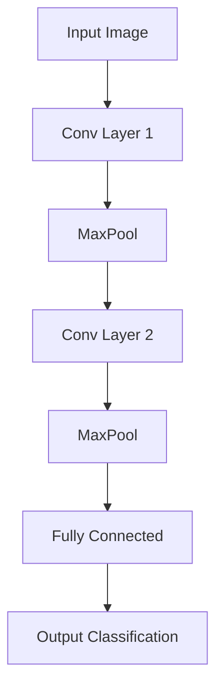

<!-- _class: lead -->

# Visual Intelligence Project

## Classificazione Automatica di Immagini Istologiche

#### Your Name | March 2025

---

<!-- header: '📊 Visual Intelligence - ML Project' -->

## 🔍 Introduzione

- **Obiettivo**: Classificazione automatica di campioni istologici polmonari
- **Sfida**: Distinguere tra diversi tipi cellulari (pneumociti I/II, macrofagi alveolari)
- **Motivazione**: Assistere i patologi nell'analisi rapida di campioni istologici

> _"L'intelligenza artificiale può migliorare la precisione diagnostica e ridurre il carico di lavoro nell'analisi istologica"_

---

## 📦 Dataset

- **Origine**: Campioni istologici polmonari con colorazione ematossilina-eosina
- **Composizione**: 3 classi principali (pneumociti tipo I, tipo II, macrofagi alveolari)
- **Dimensioni**: 1000 immagini ad alta risoluzione (768×768 px)

**Preprocessing applicato**:

- Normalizzazione del contrasto
- Augmentation (rotazioni, flipping, variazioni di luminosità)
- Ridimensionamento ottimizzato (analizzato da 768×768 a 5×5 px)

---

## 🧠 Architettura del Modello

- **Base Model**: Architettura ispirata a ResNet ma ottimizzata per dimensione
- **Alternative testate**: CNN tradizionale vs. modello leggero personalizzato
- **Efficienza**: Implementazione di mixed precision training per accelerare

---

## 💻 Dettagli Implementativi

- **Framework**: PyTorch con fastai per l'addestramento rapido
- **Hardware**: NVIDIA GeForce RTX 3090 (riduzione tempi da 4h a 45min)
- **Strategie di ottimizzazione**:
  - Data loading efficiente con `num_workers` ottimizzato
  - Batch size calibrata (32-64 immagini)
  - Learning rate finder per determinare LR ottimale

---

## 📈 Risultati & Analisi

| Modello         | Accuracy | F1-Score | Tempo Training |
| --------------- | -------- | -------- | -------------- |
| CNN base        | 87.5%    | 0.86     | 4h             |
| CNN ottimizzata | 91.2%    | 0.90     | 45min          |
| Grayscale       | 83.3%    | 0.82     | 30min          |
| Mini (5×5)      | 89.7%    | 0.88     | 10min          |

**Osservazione chiave**: Il modello funziona sorprendentemente bene anche con immagini molto ridotte (5×5 px)

---

## 🧪 Esperimenti & Scoperte

- **Riduzione dimensionale**: Anche a 5×5 pixel il modello mantiene performance elevate
- **Ipotesi**: Il modello potrebbe basarsi principalmente su pattern di colore
- **Verifica**:
  - Test con immagini in grayscale → risultati inferiori
  - Test con rimozione sfondo → ancora buoni risultati
  - **Conclusione**: Il modello impara pattern di colore associati alle classi

---

## 🚧 Sfide & Miglioramenti

- **Sfide affrontate**:

  - Sovradimensionamento iniziale del modello
  - Tempi di training eccessivi
  - Rischio di apprendimento di features non generalizzabili

- **Miglioramenti futuri**:
  - Implementare tecniche di interpretabilità (Grad-CAM, LIME)
  - Sviluppare architetture attention-based per migliore focalizzazione
  - Validazione con dataset esterni per verificare generalizzazione

---

## 🎓 Concetti ML Applicati

- **Bias-variance trade-off**: Bilanciamento complessità del modello
- **Data augmentation**: Tecniche per arricchire il dataset
- **Transfer learning vs. training from scratch**: Analisi comparativa
- **Problemi di overfitting**: Strategie implementate (dropout, regolarizzazione)

---

<!-- _class: lead -->

## 📝 Conclusioni

- Il modello leggero ottimizzato raggiunge **91.2% di accuracy**
- La scoperta dell'apprendimento basato sul colore evidenzia l'importanza dell'**interpretabilità**
- L'applicazione pratica potrebbe assistere i patologi nella **classificazione rapida** di campioni

---

<!-- _class: lead -->

# Grazie per l'attenzione!

## Domande?

Contatti:
📧 your.email@university.edu
🔗 github.com/yourusername
