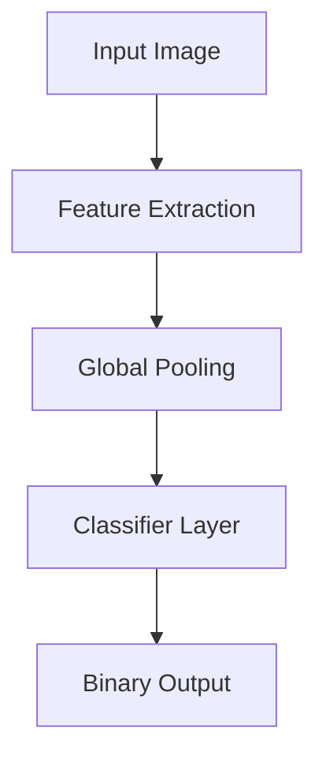

<!-- _class: lead -->

# Visual Intelligence Project

## Lung Cancer Histopathological Classification

#### Your Name | March 2025

---

## 🔍 Introduction & Problem Statement

- **Dataset**: Lung cancer histopathological image collection with 3 classes:
  - Adenocarcinoma
  - Squamous cell carcinoma
  - Benign tissue
- **Classification Task**: Binary classification (adenocarcinoma vs benign)
- **Challenge**: Distinguishing subtle tissue patterns and cellular structures
- **Project Goals**:
  - Compare traditional CNN vs ScatNet approaches
  - Investigate color vs structural features
  - Achieve high accuracy with interpretable results
  - Apply explainable AI techniques to validate model decisions

---

## 📦 Data Preprocessing & Setup

- **Dataset Organization**:
  - K-fold cross-validation with 10 folds for robust evaluation
  - Balanced class distribution
  - Target image size standardization
- **Preprocessing Pipeline**:
  - Image normalization and standardization using computed statistics
  - Data augmentation: rotations, flips, and minor distortions
  - Color vs grayscale analysis to understand feature importance

> **Key Discovery**: Models heavily rely on color features for classification, which influenced our approach to feature extraction

---

## 🧠 Model Architectures

### CNN Model

- Efficient convolutional neural network with:
  - Two primary convolutional blocks with batch normalization
  - Input channels: 1 (grayscale) or 3 (RGB)
  - Simple classifier head with 16-dimensional feature space
  - Fast training and excellent feature learning capability

### ScatNet Model

- Wavelet-based feature extraction using Scattering2D:
  - J=3 scale parameter for wavelet decomposition
  - More complex classifier (217 → 64 → 2 neurons)
  - Translation, rotation, and scaling invariant representations

---

## 💻 Training & Evaluation

| Metric                | CNN    | ScatNet |
| --------------------- | ------ | ------- |
| Mean Accuracy         | 98.9%  | 87.9%   |
| Mean F1 Score         | 98.9%  | 86.7%   |
| Best Fold Accuracy    | 99.8%  | 92.6%   |
| Training Speed        | Faster | Slower  |
| Classifier Complexity | Simple | Complex |

**Key Findings**:

- CNN significantly outperforms ScatNet in both accuracy and speed
- K-fold validation confirms robust performance across data splits
- CNN achieves convergence in fewer epochs
- Performance gap indicates CNN's superior ability to learn relevant features

---

## 🔬 Filter Analysis

- **CNN Filters**:

  - Learned color-sensitive patterns automatically
  - Hierarchical feature extraction with progressive abstraction
  - First layer captures basic edges and textures
  - Deeper layers identify tissue-specific patterns

- **ScatNet Filters**:
  - Pre-defined wavelet transforms (not learned)
  - Scale and rotation invariant features
  - Lower discriminative power despite theoretical advantages

> **Important**: Color information proved crucial for classification success

---

## 🎯 Explainable AI Results

- **Attribution Methods Implementation**:

  - Custom XAI methods: Vanilla Backpropagation, Guided Backpropagation, Occlusion
  - Captum library integration with multiple attribution techniques
  - Heatmap visualization highlighting decision regions

- **Key Insights**:
  - Attribution maps confirm focus on cellular structures
  - Color patterns strongly influence classification decisions
  - CNN's learned features align better with pathological indicators
  - ScatNet's wavelets capture texture but miss important color information

---

## 📈 Learning Curves Analysis

- **CNN Training Progression**:

  - Rapid convergence within 10-15 epochs
  - Consistent performance across folds
  - Limited overfitting due to effective regularization
  - Final validation accuracy stabilized around 99%

- **ScatNet Training Progression**:
  - Slower convergence requiring more epochs
  - Higher variance between folds (81.1% - 92.6%)
  - More complex classifier needed to compensate for fixed feature extraction
  - Validation accuracy plateaued around 88%

---

## 📊 Conclusions

- **Performance Achievements**:

  - CNN reached 98.9% mean accuracy with simpler architecture
  - ScatNet achieved 87.9% mean accuracy despite theoretical advantages
  - 11% performance gap between approaches

- **Key Insights**:

  - Color features are crucial for lung cancer histopathology classification
  - Learned features (CNN) outperform fixed mathematical representations (ScatNet)
  - Simpler architectures can outperform sophisticated ones when aligned with data characteristics

- **Future Work**:
  - Investigate grayscale performance optimization strategies
  - Expand to multi-class classification (including squamous cell carcinoma)
  - Enhance interpretability methods for clinical validation

---

<!-- _class: lead -->

# Thank You!

## Questions?

📧 your.email@university.edu
🔗 github.com/yourusername
