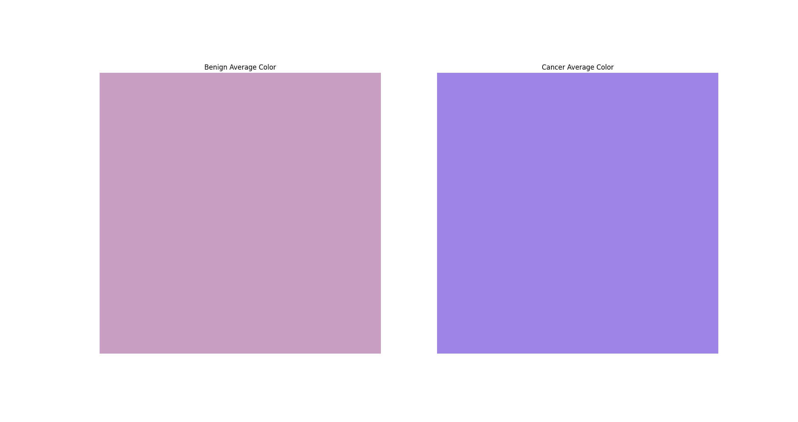
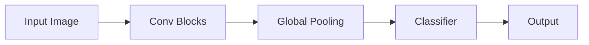
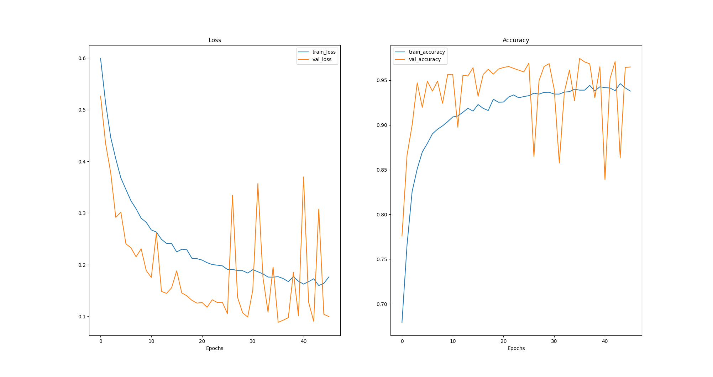
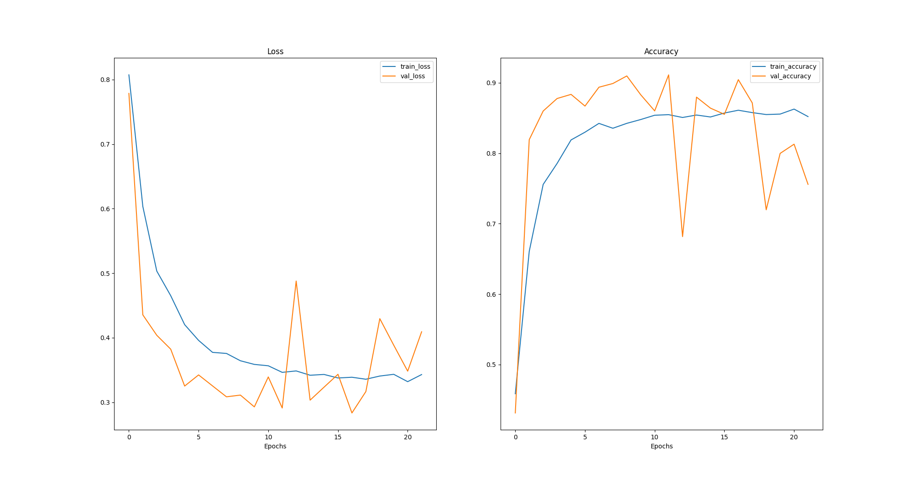
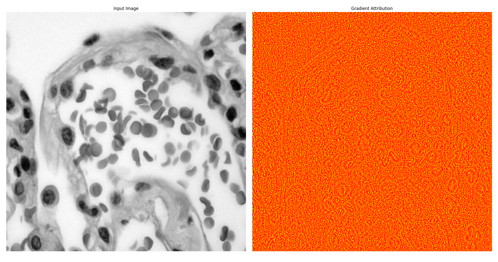
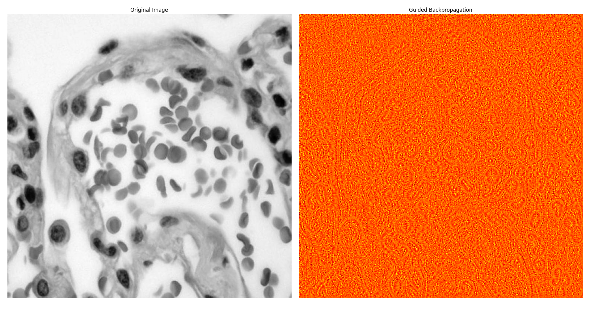
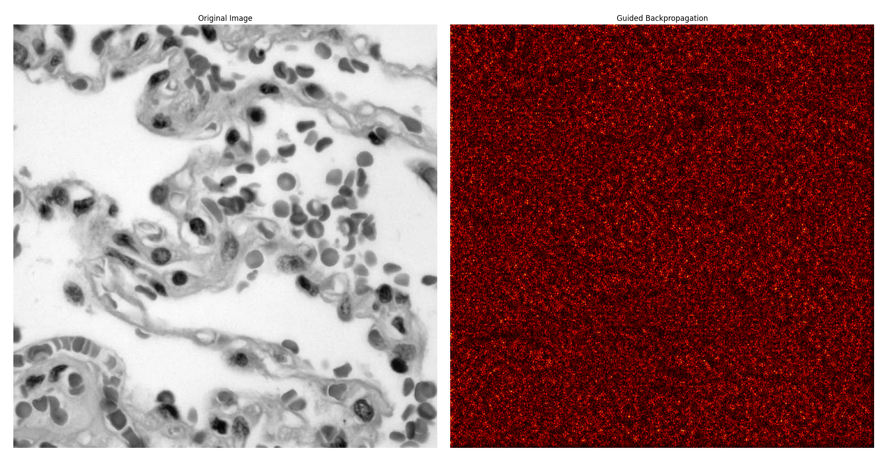

<!-- _class: lead -->

# Visual Intelligence Project

## Lung Cancer Histopathological Classification

#### Your Name | March 2025

---

## 🔍 Introduction & Problem Statement

- **Dataset**: Lung cancer histopathological images (3 classes):
  - Adenocarcinoma
  - Squamous cell carcinoma
  - Benign tissue
- **Classification Task**: Binary classification (adenocarcinoma vs benign)
- **Challenge**: Distinguishing subtle tissue patterns and cellular structures

<div style="display: grid; grid-template-columns: 1fr 1fr; gap: 10px;">


</div>

---

## 🔍 Project Goals

- Compare traditional CNN vs ScatNet approaches
- Investigate color vs structural features
- Achieve high accuracy with interpretable results
- Apply explainable AI techniques to validate model decisions

---

## 📦 Data Preprocessing & Setup

- **Dataset Organization**:
  - K-fold cross-validation with 10 folds
  - Balanced class distribution
  - Target size: 768×768 pixels (original) → 224×224 (processed)
- **Key Finding**: The class average color alone is sufficient for high-accuracy classification
  - This prompted our focus on structural features identification



---

## 📦 Preprocessing Pipeline

- Image normalization and standardization
- Data augmentation decisions:
  - Rotations (0°, 90°, 180°, 270°)
  - Horizontal and vertical flips
  - Minor elastic distortions
- Color vs grayscale analysis
  - With grayscale images, models can still achieve high accuracy
  - Focus shifted to structural features identification

> **Key Discovery**: Models heavily rely on color features for classification, but structural features are critical for generalization

---

## 🧠 CNN Model Architecture

- Efficient convolutional neural network:
  - Two convolutional blocks with batch normalization
  - Input channels: 1 (grayscale) or 3 (RGB)
  - Simple classifier head (16-dimensional feature space)
  - **Key Finding**: Good at learning even with a small classifier layer




---

## 🧠 CNN Architecture Details

```
Layer (type:depth-idx)                   Output Shape              Param #
==========================================================================================
CNNImageClassifier                       [1, 2]                    --
├─Sequential: 1-1                        [1, 24, 4, 4]             --
│    └─Conv2d: 2-1                       [1, 16, 382, 382]         1,952
│    └─BatchNorm2d: 2-2                  [1, 16, 382, 382]         32
│    └─ReLU: 2-3                         [1, 16, 382, 382]         --
│    └─MaxPool2d: 2-4                    [1, 16, 191, 191]         --
│    └─Conv2d: 2-5                       [1, 16, 191, 191]         2,320
│    └─BatchNorm2d: 2-6                  [1, 16, 191, 191]         32
│    └─ReLU: 2-7                         [1, 16, 191, 191]         --
│    └─MaxPool2d: 2-8                    [1, 16, 95, 95]           --
│    └─Conv2d: 2-9                       [1, 24, 95, 95]           3,480
│    └─BatchNorm2d: 2-10                 [1, 24, 95, 95]           48
│    └─ReLU: 2-11                        [1, 24, 95, 95]           --
│    └─AdaptiveAvgPool2d: 2-12           [1, 24, 4, 4]             --
├─FeatureClassifier: 1-2                 [1, 2]                    --
│    └─Linear: 2-13                      [1, 16]                   6,160
│    └─BatchNorm1d: 2-14                 [1, 16]                   32
│    └─ReLU: 2-15                        [1, 16]                   --
│    └─Dropout: 2-16                     [1, 16]                   --
│    └─Linear: 2-17                      [1, 2]                    34
```

- Total parameters: 14,090
- Model size: 52.58MB
- Efficient architecture with only ~14K parameters

---

## 🧠 ScatNet Model Architecture

- Wavelet-based feature extraction:
  - J=3 scale parameter for wavelet decomposition
  - L=8 orientations, M=2 scattering order
  - Complex classifier (217 → 64 → 2 neurons)
  - Translation, rotation, and scaling invariant
- **Key Finding**: Requires more complex classifier layer to achieve good performance


---

## 💻 Training & Evaluation Metrics

| Metric                | CNN    | ScatNet |
| --------------------- | ------ | ------- |
| Mean Accuracy         | 98.9%  | 87.9%   |
| Mean F1 Score         | 98.9%  | 86.7%   |
| Best Fold Accuracy    | 99.6%  | 92.6%   |
| Training Speed        | Faster | Slower  |
| Classifier Complexity | Simple | Complex |

**Note**: Values directly from the 10-fold cross-validation experiments

---

## 💻 CNN Performance Details

**Fold-by-fold performance**:

- Fold 0: 97.6% Accuracy, 97.6% F1 Score
- Fold 1: 97.6% Accuracy, 97.6% F1 Score
- Fold 2: 99.2% Accuracy, 99.2% F1 Score
- Fold 3: 99.3% Accuracy, 99.3% F1 Score
- Fold 4: 98.2% Accuracy, 98.2% F1 Score
- Fold 5: 99.3% Accuracy, 99.3% F1 Score
- Fold 6: 99.5% Accuracy, 99.5% F1 Score
- Fold 7: 99.1% Accuracy, 99.1% F1 Score
- Fold 8: 99.6% Accuracy, 99.6% F1 Score
- Fold 9: 99.3% Accuracy, 99.3% F1 Score

**Mean Accuracy**: 98.9%
**Mean F1 Score**: 98.9%

---

## 💻 ScatNet Performance Details

**Fold-by-fold performance**:

- Fold 0: 91.1% Accuracy, 90.8% F1 Score
- Fold 1: 92.6% Accuracy, 92.7% F1 Score
- Fold 2: 88.7% Accuracy, 87.8% F1 Score
- Fold 3: 88.9% Accuracy, 88.0% F1 Score
- Fold 4: 88.2% Accuracy, 87.3% F1 Score
- Fold 5: 81.1% Accuracy, 77.4% F1 Score (lowest)
- Fold 6: 85.0% Accuracy, 82.8% F1 Score
- Fold 7: 87.8% Accuracy, 86.7% F1 Score
- Fold 8: 88.9% Accuracy, 88.2% F1 Score
- Fold 9: 86.5% Accuracy, 85.2% F1 Score

**Mean Accuracy**: 87.9%
**Mean F1 Score**: 86.7%

---

## 💻 Key Performance Findings

- CNN significantly outperforms ScatNet in both accuracy and speed
  - 11% mean accuracy difference (98.9% vs 87.9%)
- K-fold validation confirms robust performance across data splits
  - CNN shows less variance between folds
- CNN achieves convergence in fewer epochs
- Performance gap indicates CNN's superior ability to learn relevant features

---

## 📈 CNN Learning Curves Analysis

- Rapid convergence within 10-15 epochs
- Consistent performance across folds
- Limited overfitting due to effective regularization
- Final validation accuracy stabilized around 99%
- More efficient training compared to ScatNet



---

## 📈 ScatNet Learning Curves Analysis

- Slower convergence requiring more epochs
- Higher variance between folds (81.1% - 92.6%)
- More complex classifier needed for good performance
- Validation accuracy plateaued around 88%
- Greater performance variation across data splits



---

## 🔬 CNN Filter Analysis

- Learned color-sensitive patterns automatically
- Hierarchical feature extraction with progressive abstraction
- First layer captures basic edges and textures
- Deeper layers identify tissue-specific patterns
- Impact of data augmentation: improved filter robustness to orientations


---

## 🔬 ScatNet Filter Analysis

- Pre-defined wavelet transforms (not learned)
- Scale and rotation invariant features
- Lower discriminative power despite theoretical advantages
- Fixed mathematical representation limits adaptability
- Data augmentation impact: less significant due to inherent invariance


---

## 🎯 Explainable AI Methods

- **Custom Attribution Methods**:
  - Vanilla Backpropagation
  - Guided Backpropagation
  - Occlusion
- **Captum Library Integration**:
  - Multiple attribution techniques
  - Heatmap visualization highlighting decision regions

<div style="display: grid; grid-template-columns: 1fr 1fr; gap: 10px;">


</div>

---

## 🎯 CNN Attribution Analysis

- Visualizes regions most influential for classification decisions
- Focuses on cellular structures and color patterns
- Higher resolution in feature attribution
- Strong correlation between attribution maps and pathological markers

<div style="display: grid; grid-template-columns: 1fr 1fr; gap: 10px;">


</div>

---

## 🎯 ScatNet Attribution Analysis

- Different activation patterns compared to CNN
- More diffuse attribution regions
- Wavelets capture texture but miss important color information
- Less aligned with pathological indicators

<div style="display: grid; grid-template-columns: 1fr 1fr; gap: 10px;">


</div>

---

## 🔍 Custom vs. Library Implementation

- **Custom Implementation**:

  - Complete control over visualization parameters
  - Direct access to gradient computation
  - Greater understanding of attribution mechanics

- **Captum Library**:
  - More visualization options and integrated smoothing
  - Consistent API across different attribution methods
  - Better computational performance

> **Analysis**: Both implementations highlight similar regions, validating our approach

---

## 📊 Performance Summary

- **Performance Achievements**:
  - CNN: 98.9% mean accuracy with simpler architecture
  - ScatNet: 87.9% mean accuracy despite theoretical advantages
  - 11% performance gap between approaches
- **Computational Efficiency**:
  - CNN showed faster training times
  - ScatNet required more complex classifier to achieve reasonable performance

---

## 📊 Key Insights

- Color features are crucial for lung cancer histopathology classification
  - The class average color alone is highly predictive
- Learned features (CNN) outperform fixed mathematical representations (ScatNet)
- Simpler architectures can outperform sophisticated ones when aligned with data characteristics
- Even with grayscale images, the models achieved high accuracy
  - Focusing on structural features rather than just color

---

<!-- _class: lead -->

# Thank You!

## Questions?

📧 your.email@university.edu
🔗 github.com/yourusername
