<!-- _class: lead -->

# Visual Intelligence Project

## Lung Cancer Histopathological Classification

#### Lorenzo Mioso | March 2025

---

## Introduction & Problem Statement

- **Dataset**: Lung cancer histopathological images (3 classes):
  - **Adenocarcinoma**
  - **Squamous cell carcinoma**
  - **Benign tissue**
- **Classification Task**: **Binary classification** (adenocarcinoma vs benign)
- **Challenge**: Distinguishing **subtle tissue patterns** and **cellular structures**

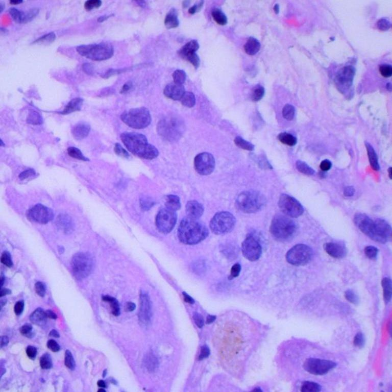
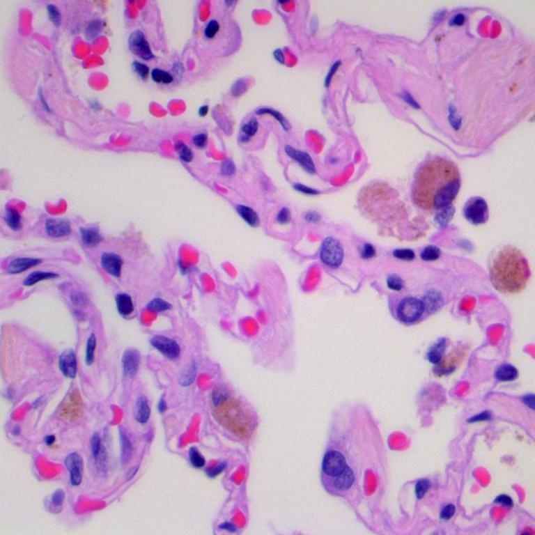

---

## Project Goals

- Compare **traditional CNN** vs **ScatNet** approaches
- Investigate **color** vs **structural features**
- Achieve **high accuracy** with **interpretable results**
- Apply **explainable AI techniques** to validate model decisions

---

## Data Preprocessing & Setup

- **Dataset Organization**:
  - **K-fold cross-validation** with 10 folds
  - Class distributions already balanced
  - Image size kept at **768×768 pixels**
  - **Grayscale conversion** for analysis

> **Key Finding**: Using grayscale images for analysis because with only color images, the model achieved high accuracy by learning **color distributions**

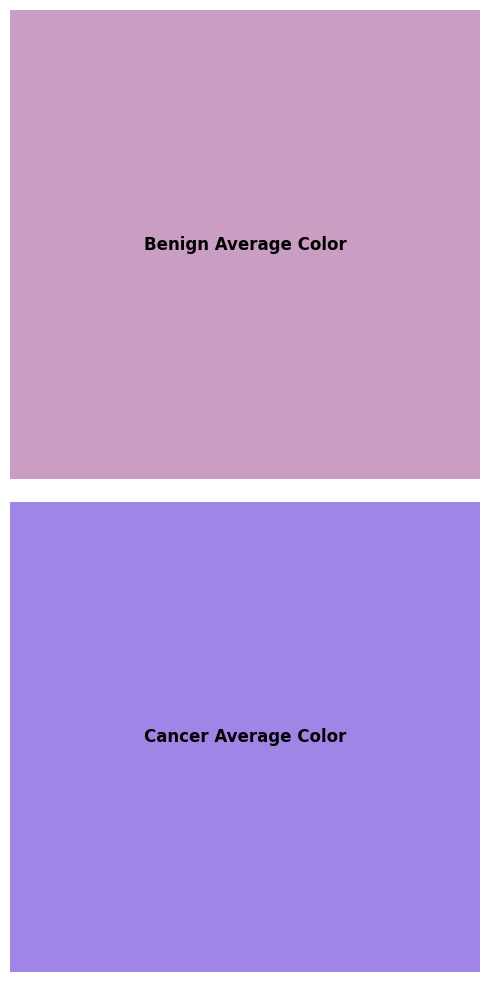

---

## Preprocessing Pipeline

- Image **normalization** and **standardization** for each fold to avoid data leakage
- Data augmentation decisions (dataset comes already augmented) :
  - Random rotations
  - Random flips
  - Color jittering
  - Random cropping
  - Gaussian noise

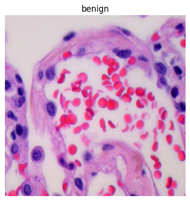
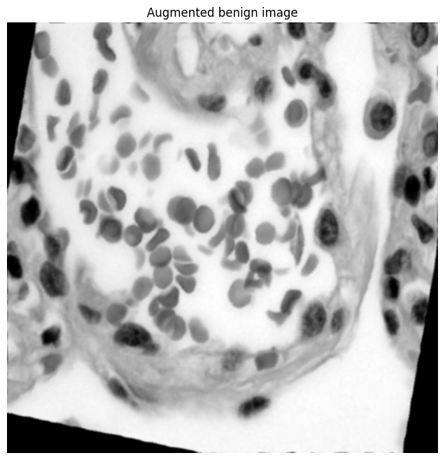

---

## CNN Model Architecture

- **Efficient Feature Extraction Design**:

  - Similar to **ResNet architecture** without skip connections
  - Three progressive convolutional blocks with increasing feature depth (**16→16→24**)
  - First convolutional layer with **11×11 kernel** for showing generated filters
  - Strategic dimensionality reduction via **max pooling** and stride control
  - **Batch normalization** for improved training stability and feature quality
  - **ReLU activations** for capturing non-linear patterns in tissue structures

> **Key Finding**: Achieves **exceptional classification accuracy** despite minimal parameter count
> **Key Finding**: First layer filters may not appear visually interpretable with small learning rates, despite good performance

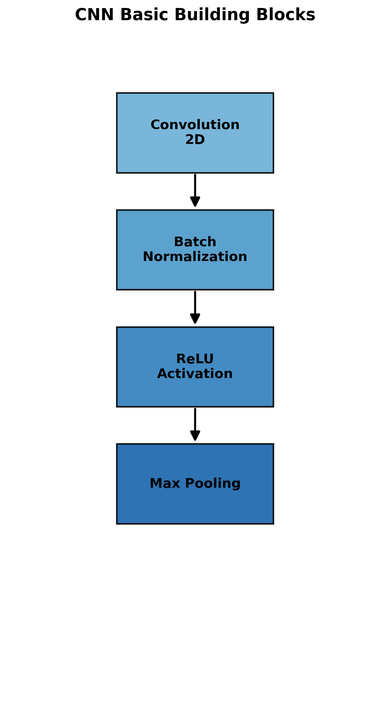

<!-- This image should represent the basic CNN block: Conv -> BatchNorm -> ReLU -> Pooling -->

---

## CNN Architecture Details

```
 CNNImageClassifier(
  (features): Sequential(
    (0): Conv2d(1, 16, kernel_size=(11, 11), stride=(2, 2), padding=(3, 3))
    (1): BatchNorm2d(16, eps=1e-05, momentum=0.1, affine=True, track_running_stats=True)
    (2): ReLU()
    (3): MaxPool2d(kernel_size=2, stride=2, padding=0, dilation=1, ceil_mode=False)
    (4): Conv2d(16, 16, kernel_size=(3, 3), stride=(1, 1), padding=(1, 1))
    (5): BatchNorm2d(16, eps=1e-05, momentum=0.1, affine=True, track_running_stats=True)
    (6): ReLU()
    (7): MaxPool2d(kernel_size=2, stride=2, padding=0, dilation=1, ceil_mode=False)
    (8): Conv2d(16, 24, kernel_size=(3, 3), stride=(1, 1), padding=(1, 1))
    (9): BatchNorm2d(24, eps=1e-05, momentum=0.1, affine=True, track_running_stats=True)
    (10): ReLU()
    (11): AdaptiveAvgPool2d(output_size=(4, 4))
  )
  (classifier): FeatureClassifier(
    (fc1): Linear(in_features=384, out_features=16, bias=True)
    (bn): BatchNorm1d(16, eps=1e-05, momentum=0.1, affine=True, track_running_stats=True)
    (relu): ReLU()
    (do): Dropout(p=0.5, inplace=False)
    (fc2): Linear(in_features=16, out_features=2, bias=True)
  )
)
```

- Total parameters: **14,090**
- Model size: **52.58MB**
- **Efficient architecture** with only ~14K parameters

---

## ScatNet Model Architecture

- **Wavelet-based feature extraction**:
  - **J=3** scale parameter for wavelet decomposition
  - **L=8** orientations, **M=2** scattering order
  - **Translation**, **rotation**, and **scaling invariant**

```
ScatNetImageClassifier(
  (scattering): Scattering2D()
  (global_pool): AdaptiveAvgPool2d(output_size=(4, 4))
  (classifier): FeatureClassifier(
    (fc1): Linear(in_features=3472, out_features=16, bias=True)
    (bn): BatchNorm1d(16, eps=1e-05, momentum=0.1, affine=True, track_running_stats=True)
    (relu): ReLU()
    (do): Dropout(p=0.5, inplace=False)
    (fc2): Linear(in_features=16, out_features=2, bias=True)
  )
)
```

- **Key Finding**: Requires **more complex classifier** layer to achieve good performance

---

## CNN Learning Curves Analysis

- **Rapid convergence** within 15 epochs but slightly slower than ScatNet
- **Consistent performance** across folds
- **Limited overfitting** due to effective regularization
- Final validation accuracy stabilized around **99%**

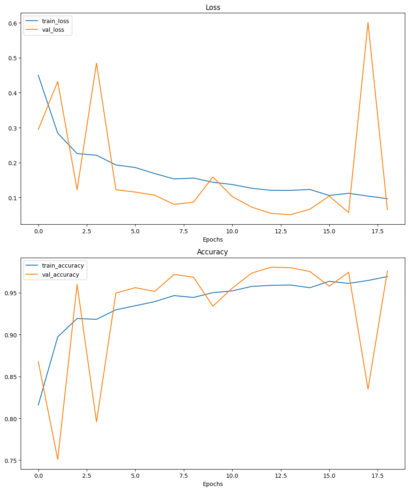

---

## ScatNet Learning Curves Analysis

- **Slower convergence** requiring less epochs due to lower complexity
- **More complex classifier** needed for good performance
- **Greater performance variation** across folds

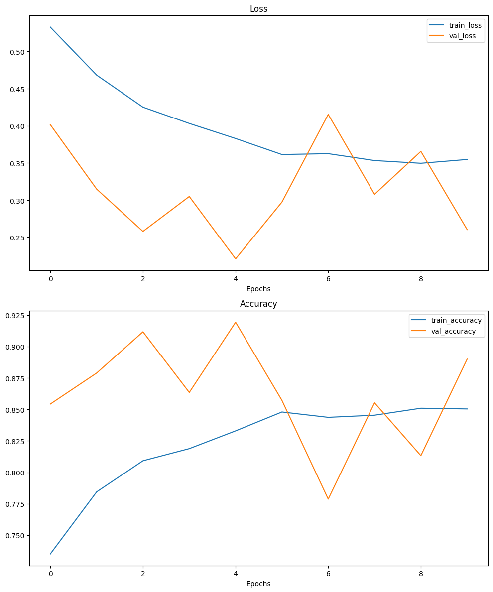

---

## Performance Results & Analysis

| Metric         | CNN                 | ScatNet             |
| -------------- | ------------------- | ------------------- |
| Mean Accuracy  | **99.26% ± 0.72%**  | **92.99% ± 1.59%**  |
| Mean F1 Score  | **99.27% ± 0.72%**  | **92.83% ± 1.70%**  |
| Accuracy Range | **97.70% - 99.90%** | **89.10% - 95.10%** |
| Training Speed | **Faster**          | **Slower**          |

**Key Performance Findings:**

- CNN **significantly outperforms** ScatNet in accuracy (by **6.27%**)
- K-fold validation confirms **robust performance** across data splits
  - CNN shows **less variance** between folds
- CNN achieves convergence in **fewer epochs**
- Performance gap indicates CNN's **superior ability** to learn relevant features

---

## CNN Performance Summary

**Performance Range:**

- Accuracy: **98.00% - 99.90%** across all folds
- F1 Score: **98.01% - 99.90%** across all folds
- Most consistent fold: **Fold 9** (99.90% accuracy)
- All folds achieved **>97.70% accuracy**

**Overall Statistics:**

- Mean Accuracy: **99.26%**
- Mean F1 Score: **99.27%**
- Standard Deviation: **0.72%**

---

## ScatNet Performance Summary

**Performance Range:**

- Accuracy: **89.10% - 95.10%** across all folds
- F1 Score: **88.68% - 95.06%** across all folds
- Best performing fold: **Fold 6** (95.10% accuracy)
- Worst performing fold: **Fold 1** (89.10% accuracy)

**Overall Statistics:**

- Mean Accuracy: **92.99%**
- Mean F1 Score: **92.83%**
- Standard Deviation: **1.59%**

---

## Key Performance Findings

- CNN **significantly outperforms** ScatNet in both accuracy and speed
  - **6.27% mean accuracy difference** (99.26% vs 92.99%)
- K-fold validation confirms **robust performance** across data splits
  - CNN shows **less variance** between folds (0.72% vs 1.59%)
- CNN achieves convergence in **fewer epochs**
- Performance gap indicates CNN's **superior ability** to learn relevant features

---

## CNN Filter Analysis

- Learned **color-sensitive patterns** automatically
- **Hierarchical feature extraction** with progressive abstraction
- First layer captures **basic edges and textures**
- Deeper layers identify **tissue-specific patterns**
- Impact of data augmentation: improved **filter robustness** to orientations


---

## ScatNet Filter Analysis

- **Pre-defined wavelet transforms** (not learned)
- **Scale and rotation invariant** features
- **Lower discriminative power** despite theoretical advantages
- Fixed mathematical representation **limits adaptability**
- Data augmentation impact: **less significant** due to inherent invariance

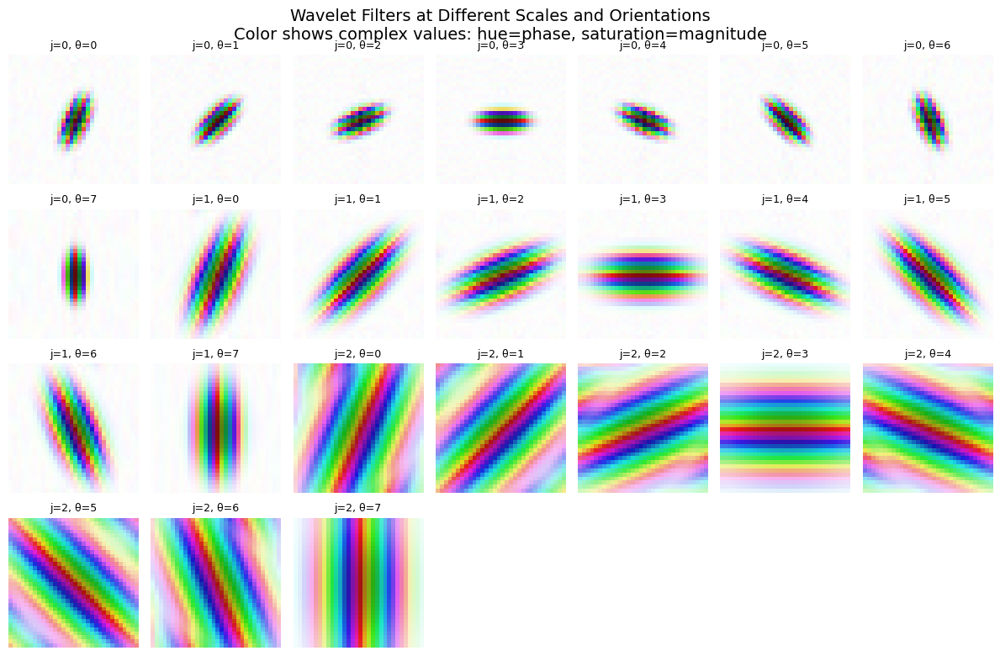
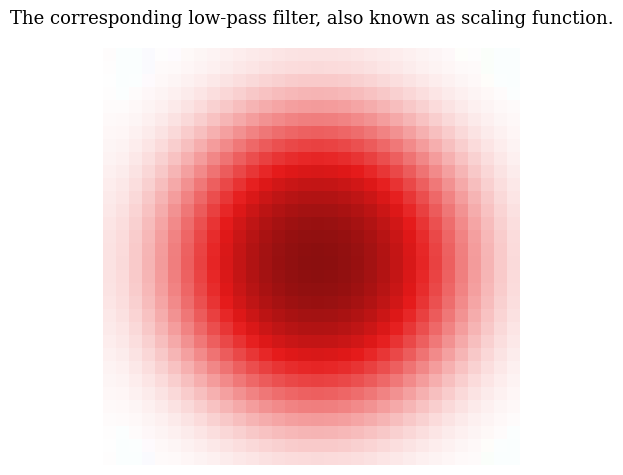

---

## CNN Attribution Analysis

- Visualizes regions **most influential** for classification decisions
- Focuses on **cellular structures** and **color patterns**
- **Higher resolution** in feature attribution
- **Strong correlation** between attribution maps and pathological markers


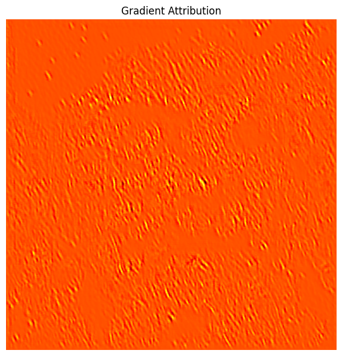
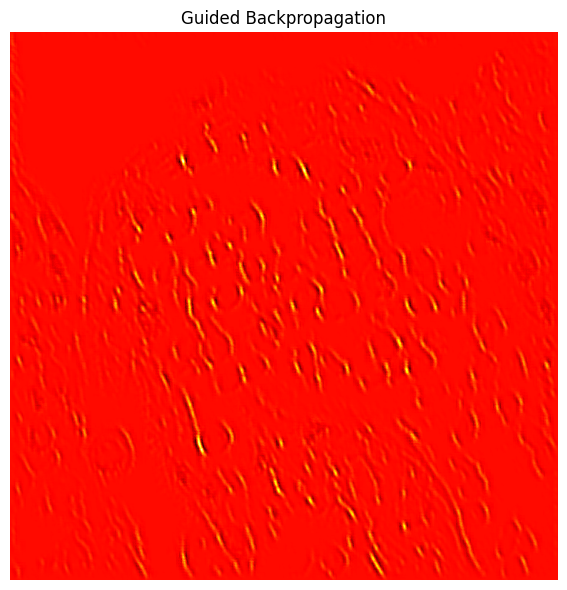
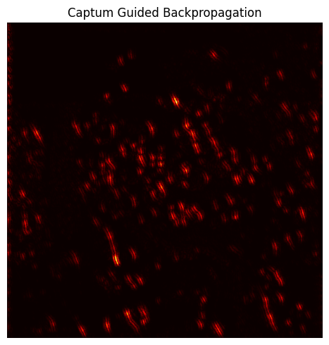

---

## ScatNet Attribution Analysis

- **Different activation patterns** compared to CNN
- **More diffuse attribution regions**
- Wavelets capture **texture** but miss important **color information**
- **Less aligned** with pathological indicators


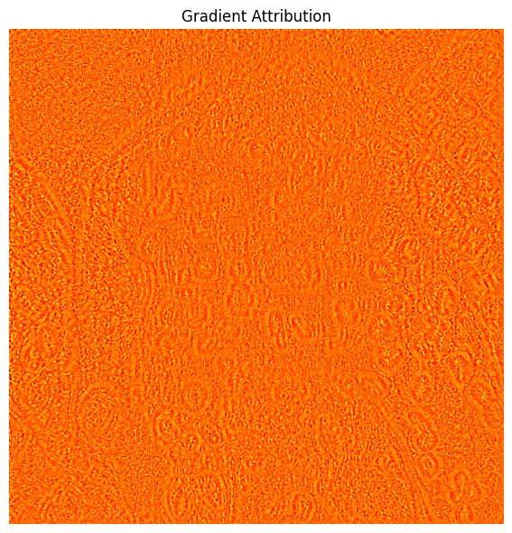
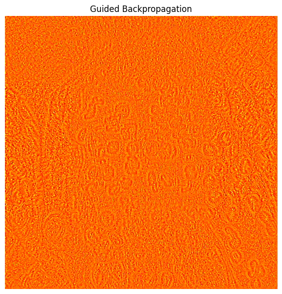
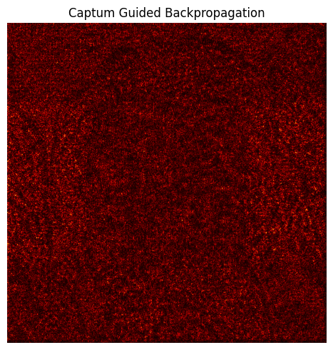

---

## Custom vs. Library Implementation

- **Custom Implementation**:

  - Complete control over **visualization parameters**
  - Direct access to **gradient computation**
  - Greater understanding of **attribution mechanics**

- **Captum Library**:

  - More **visualization options** and integrated smoothing
  - **Consistent API** across different attribution methods
  - Better **computational performance**

- **Analysis**: Both implementations highlight similar regions, **validating our approach**

---

## Key Insights

- **Color features** are crucial for lung cancer histopathology classification
  - The class average color alone is **highly predictive**
- **Learned features** (CNN) outperform **fixed mathematical representations** (ScatNet)
- **Simpler architectures** can outperform sophisticated ones when aligned with data characteristics
- Even with grayscale images, the models achieved **high accuracy**
  - Focusing on **structural features** rather than just color

---

<!-- _class: lead -->

# End

Lorenzo Mioso
